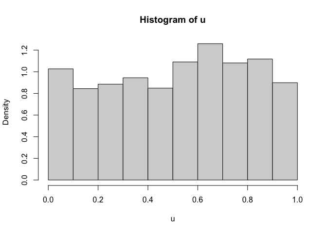

# gamvinereg: D-Vine GAM Copula based Quantile Regression

<!-- badges: start -->

[](https://CRAN.R-project.org/package=gamvinereg)
[](https://github.com/jobstdavid/gamvinereg/actions)
[](https://github.com/jobstdavid/gamvinereg)
<!-- badges: end -->

An R package for D-vine copula based quantile regression using bivariate
conditional copulas as described in the references.

It depends on the R-packages:

-   [VineCopula](https://cran.r-project.org/web/packages/VineCopula/index.html),
    [gamCopula](https://cran.r-project.org/web/packages/gamCopula/index.html):
    Including bivariate conditional copulas, where Kendall’s $\tau$ or
    the copula parameter is linked to a partially linear model using GAM
    and/or spline smoothing. The bivariate conditional copula family set
    for modeling the dependencies consists of the Gaussian, Student-t,
    double Clayton type I-IV and double Gumbel type I-IV copula as
    implemented in the R-package
    [gamCopula](https://cran.r-project.org/web/packages/gamCopula/index.html).
    The double Clayton and Gumbel copula type consist of additional
    rotated versions of the Clayton and Gumbel copula, respectively to
    cover negative dependence as well.
-   [gamlss](https://cran.r-project.org/web/packages/gamlss/index.html):
    Margins can be selected from a large set of parametric distribution
    families using general additive models for location, scale and shape
    (GAMLSS).
-   [gamlss.tr](https://cran.r-project.org/web/packages/gamlss.tr/index.html):
    GAMLSS extension to allow for truncated distribution families.
-   [gamlss.cens](https://cran.r-project.org/web/packages/gamlss.cens/index.html):
    GAMLSS extension to allow for censored distribution families.
-   [gamlss.dist](https://cran.r-project.org/web/packages/gamlss.dist/index.html):
    GAMLSS extension to allow for distribution families with transformed
    response.

## Installation

You can install the development version from GitHub with:

``` r
# install.packages("remotes")
remotes::install_github("jobstdavid/gamvinereg")
```

## Package overview

Below is an overview of the most important functions:

-   `gamvinereg`: selects most relevant predictor variables from the
    given data to make predictions based on a D-vine GAM copula. It
    returns an object of class `gamvinereg`. The class has the following
    methods:

    -   `print`: a brief overview of the model statistics.
    -   `summary`: a more detailed overview of the selected response
        margin distribution and bivariate conditional copulas.

-   `predict`: make predictions at a given quantile level.

-   `pit`: calculate the probabililty integral transformed (PIT) values
    for the response given the predictor variables.

-   `gam_control`: configuration of the bivariate conditional copula.

## Example

### Load R-package and data

``` r
# load package
library(gamvinereg)
#> Loading required package: gamlss
#> Loading required package: splines
#> Loading required package: gamlss.data
#> 
#> Attaching package: 'gamlss.data'
#> The following object is masked from 'package:datasets':
#> 
#>     sleep
#> Loading required package: gamlss.dist
#> Loading required package: MASS
#> Loading required package: nlme
#> Loading required package: parallel
#>  **********   GAMLSS Version 5.4-12  **********
#> For more on GAMLSS look at https://www.gamlss.com/
#> Type gamlssNews() to see new features/changes/bug fixes.
#> Loading required package: gamlss.tr
#> Loading required package: gamlss.cens
#> Loading required package: survival

# load data for station Hannover
data(station)
```

### Specify margins

``` r
## generate margin distributions
# generate left-truncated at 0 normal distribution
gen.trun(par = 0, family = "NO", type = "left")
#> A truncated family of distributions from NO has been generated 
#>  and saved under the names:  
#>  dNOtr pNOtr qNOtr rNOtr NOtr 
#> The type of truncation is left 
#>  and the truncation parameter is 0
# generate left-censored normal distribution
gen.cens(family = "NO", type = "left")
#> A censored family of distributions from NO has been generated 
#>  and saved under the names:  
#>  dNOlc pNOlc qNOlc NOlc 
#> The type of censoring is left
# generate log-normal distribution
gen.Family(family = "NO", type = "log")
#> A  log  family of distributions from NO has been generated 
#>  and saved under the names:  
#>  dlogNO plogNO qlogNO rlogNO logNO

## margin specifications to select from
 margins <- list(

  # margin for variable obs (normal distribution)
  list(list(family = NO(),
            mu.formula = obs ~ sin1 + cos1,
            sigma.formula = ~ sin1 + cos1)),

  # margin for variable t2m_mean (normal distribution)
  list(list(family = NO(),
            mu.formula = t2m_mean ~ sin1 + cos1,
            sigma.formula = ~ sin1 + cos1)),

  # margins for variable t2m_sd (log-normal, left-truncated/censored at 0 normal distribution)
  list(list(family = logNO(),
            mu.formula = t2m_sd ~ sin1 + cos1,
            sigma.formula = ~ sin1 + cos1),
       list(family = NOtr(),
            mu.formula = t2m_sd ~ sin1 + cos1,
            sigma.formula = ~ sin1 + cos1),
       list(family = NOlc(),
            mu.formula = Surv(t2m_sd, t2m_sd > 0, type = "left") ~ sin1 + cos1,
            sigma.formula = ~ sin1 + cos1))

)
```

### Fit gamvinereg

``` r
# fit gamvinereg with time-dependent linear correlation model
(object <- gamvinereg(formula = obs ~ t2m_mean + t2m_sd,
                      data = station,
                      control = gam_control(formula = ~ sin1 + cos1),
                      margins = margins))
#> D-vine regression model: obs | t2m_mean, t2m_sd 
#> GAM copula regression model: tau | sin1 + cos1 
#> nobs = 2191, edf = 13, cll = -3454.46, caic = 6934.92, cbic = 7008.92
```

### Make quantile predictions

``` r
# predict median
med <- predict(object, newdata = station, alpha = 0.5)

# predict deciles
dec <- predict(object, newdata = station, alpha = 1:9/10)
```

### Calculate PIT values

``` r
# calculate PIT values
u <- pit(object, newdata = station)
# should be approximately uniform
hist(u, prob = TRUE)
```



## Contact

Feel free to contact <jobstd@uni-hildesheim.de> if you have any
questions or suggestions.

## References

Jobst, D., Möller, A., and Groß, J. (2023). D-Vine GAM Copula based
Quantile Regression with Application to Ensemble Postprocessing. doi:
[10.48550/arXiv.2309.05603](https://arxiv.org/abs/2309.05603).
